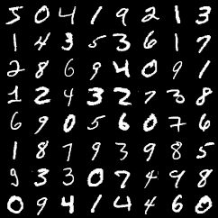
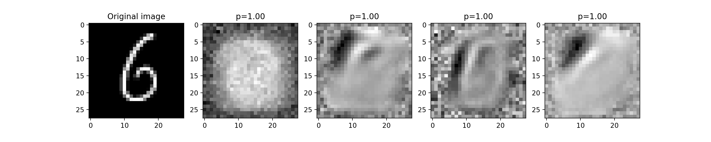

# Restricted Boltzmann Machine
An implementation of Restricted Boltzmann Machine in Pytorch. The detailed tutorial can be found [here](https://bacnguyencong.github.io/posts/2019/03/).

#### Real images

#### Generated images

#### Factorization

### References
1. [Binary RBM with Contrastive Divergence](http://www.cs.toronto.edu/~fritz/absps/cdmiguel.pdf)
2. [A tutorial on RBM](http://deeplearning.net/tutorial/rbm.html)
3. [Binary RBM with Persistent Contrastive Divergence](http://www.cs.toronto.edu/~tijmen/pcd/pcd.pdf)
4. [A Practical Guide to Training Restricted Boltzmann Machines](https://www.cs.toronto.edu/~hinton/absps/guideTR.pdf)
5. [Restricted Boltzmann Machines for Collaborative Filtering](https://www.cs.toronto.edu/~rsalakhu/papers/rbmcf.pdf)
